# CSE632 Final Project

**NGINX Web Server deployed on AWS EC2 using Terraform**

## Student Info

- **Name:** Khanh Le
- **Course:** Introduction to Cloud Computing
- **GitHub Repo:** https://github.com/monkeybuzinis/cse632-0626-final

## Project Structure

cse632-0626-final/

```text
├── terraform/
│   ├── main.tf        # EC2 instance, Security Groups
│   ├── variables.tf   # Region, instance type, key name
│   └── outputs.tf     # Public IP, DNS, SSH command
├── index.html         # Website served by NGINX
└── README.md
```

## Architecture

```
Local Machine
(terraform apply)
│
▼
AWS EC2 Instance (Amazon Linux 2023, t3.micro)
├── Security Group (ports 22 and 80 open)
├── NGINX Web Server
└── index.html (served to internet)
```

## Deployment Steps

### Prerequisites

#### 1. Install AWS CLI

```bash
curl "https://awscli.amazonaws.com/awscli-exe-linux-x86_64.zip" -o "awscliv2.zip"
unzip awscliv2.zip
sudo ./aws/install
aws --version
```

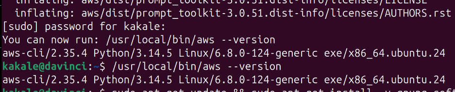

#### 2. Configure AWS CLI

Create an IAM user in AWS Console with AdministratorAccess policy, then run:

```bash
aws configure
# AWS Access Key ID: <your access key>
# AWS Secret Access Key: <your secret key>
# Default region name: us-east-1
# Default output format: json
```

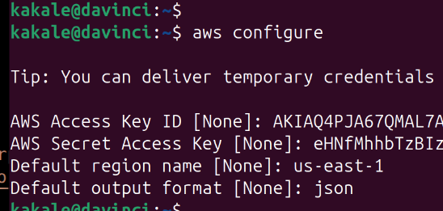

#### 3. Install Terraform

```bash
sudo apt-get update && sudo apt-get install -y gnupg software-properties-common
wget -O- https://apt.releases.hashicorp.com/gpg | sudo gpg --dearmor -o /usr/share/keyrings/hashicorp-archive-keyring.gpg
echo "deb [signed-by=/usr/share/keyrings/hashicorp-archive-keyring.gpg] https://apt.releases.hashicorp.com $(lsb_release -cs) main" | sudo tee /etc/apt/sources.list.d/hashicorp.list
sudo apt-get update && sudo apt-get install terraform
terraform version
```

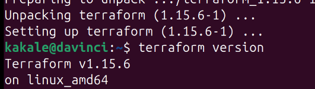

#### 4. Create SSH Key Pair in AWS

```bash
aws ec2 create-key-pair \
  --key-name cse632-key \
  --region us-east-1 \
  --query 'KeyMaterial' \
  --output text > ~/cse632-key.pem
chmod 400 ~/cse632-key.pem
```

### Step 1 - Deploy with Terraform

```bash
cd terraform
terraform init
```

```
terraform plan
```

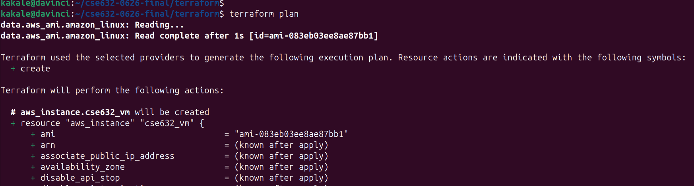

```
terraform apply
```

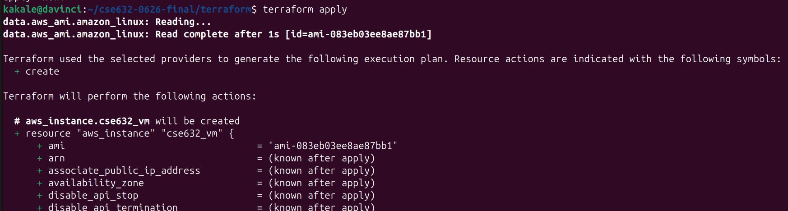
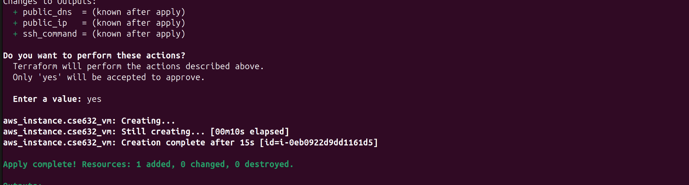
Terraform will output the public IP of your server at the end.

### Step 2 - SSH into the server

```bash
ssh -i ~/cse632-key.pem ec2-user@<public_ip>
```

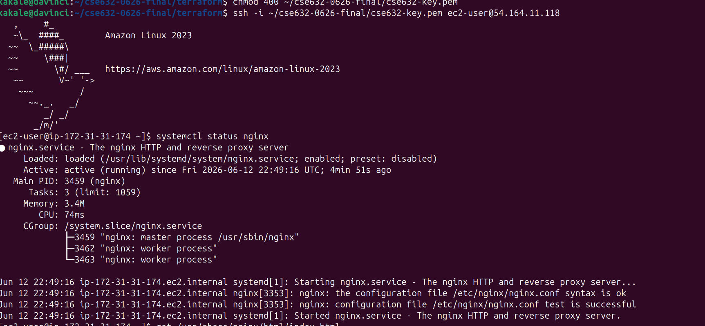

### Step 3 - Verify NGINX is running

```bash
systemctl status nginx
```

You should see `Active: active (running)`.

### Step 4 - Visit the website

Open your browser and go to:
http://<public_ip>
> **Note:** The public IP changes every time you run `terraform apply`. 
> Use the IP shown in the Terraform output after deployment.


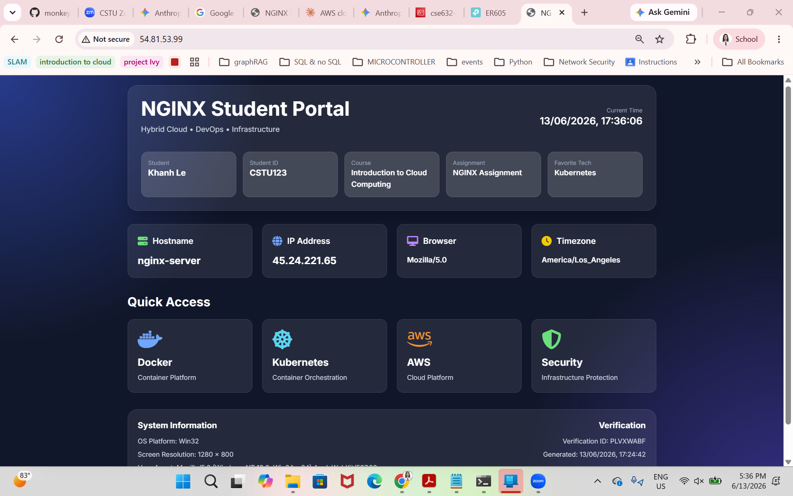

## How it works

- Terraform creates an EC2 instance with a Security Group that opens port 22 (SSH) and port 80 (HTTP)
- On first boot, the EC2 instance automatically runs a startup script (user_data) that:
  1. Updates the system packages (`dnf update -y`)
  2. Installs NGINX web server (`dnf install -y nginx`)
  3. Starts and enables NGINX service (`systemctl start nginx`)
  4. Disables the firewall (`systemctl stop firewalld`)
  5. Downloads index.html from GitHub into NGINX web directory (`/usr/share/nginx/html/`)

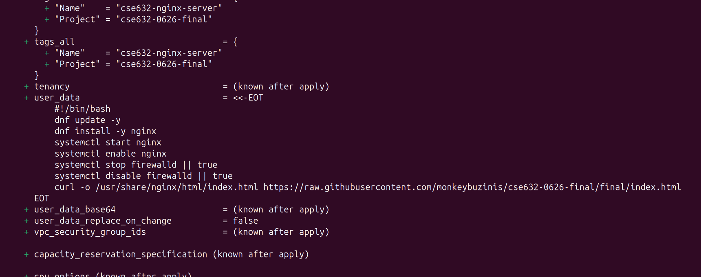

## Cleanup

To destroy all AWS resources:

```bash
cd terraform
terraform destroy
```

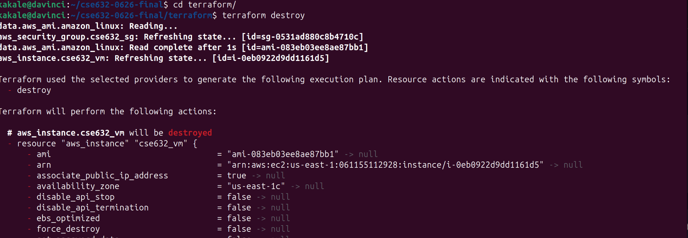
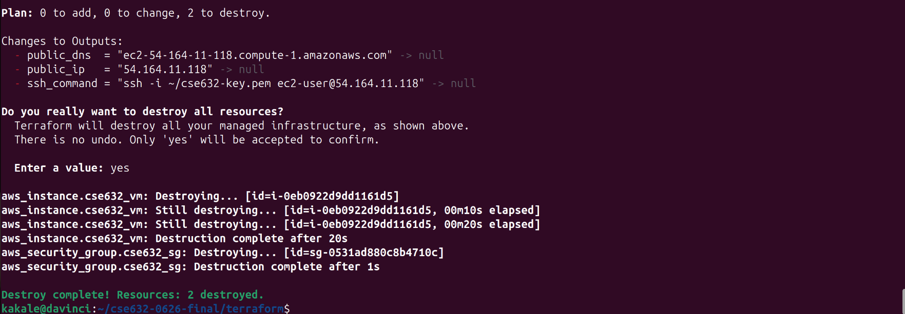
